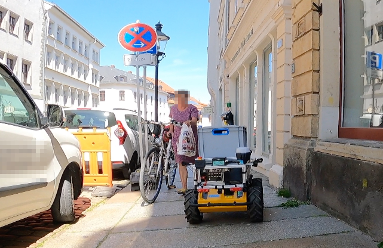

<!--
author:  André Dietrich; Sebastian Zug

mode:   Presentation

comment: Interactive LiaScript workshop at Federal University of Amazonas

-->

[](https://liascript.github.io/course/?https://raw.githubusercontent.com/SebastianZug/Introduction_to_ROS2/main/README.md)

# LiaScript Tutorial

<h2> Federal University of Amazonas</h2>

__9th December 2023__

<div style="width: 55%; float: left">

| Time          | Topic                                                                                                                                                        |
| ------------- | ------------------------------------------------------------------------------------------------------------------------------------------------------------ |
| 10:00 - 10:10 | Live Demo - Implementation of Remote-Labs integrated in LiaScript                                                                                            |
| 10:10 - 11:30 | [Basics of ROS](https://liascript.github.io/course/?https://raw.githubusercontent.com/SebastianZug/Introduction_to_ROS2/main/ROS2_concepts.md)               |
| 11:30 - 11:45 | _Short break_                                                                                                                                                |
| 11:45 - 12:30 | [Writing our own node ](https://liascript.github.io/course/?https://raw.githubusercontent.com/SebastianZug/Introduction_to_ROS2/main/Tutorial_pythonNode.md) |
| 12:30 - 13:00 | [Turtlebot Demonstration](https://liascript.github.io/course/?https://raw.githubusercontent.com/SebastianZug/Introduction_to_ROS2/main/Turtlebot_demo.md)    |

</div>

<!-- style="width: 45%; float: right" -->

<div style="width: 100%;">

> All materials of this course are available on Github:
>
> https://github.com/SebastianZug/Introduction_to_ROS2

</div>

## Presenters

| Name        |       eMail       |
| ----------------------- |:---------------------------------------:|
| Prof. Dr. Sebastian Zug | [sebastian.zug\@informatik.tu-freiberg.de](https://raw.githubusercontent.com/LiaPlayground/OEB-2023/main/mailto:sebastian.zug@informatik.tu-freiberg.de) | 


+ Prof. for Software development and Robotics at Technische Universität Freiberg since 2018
+ Working with Python since 15 years especially in robotic contexts





_Impressions of project __RobotTraces__ implemented by Hochschule Schmalkalden and Technische Universität Freiberg_

## ROS2 Installation process

> Let's run the installation process in parallel to the presentation. You can find the installation instructions in the [ROS2 documentation](https://docs.ros.org/en/humble/Installation/Ubuntu-Install-Debians.html).

You will need to add the ROS 2 apt repository to your system. Afterwards you are able to run:

```
sudo apt install ros-humble-desktop
sudo apt install ros-dev-tools
sudo apt install ros-humble-turtlesim 
```

Dont forget to source the ROS2 environment:

```
# Replace ".bash" with your shell if you're not using bash
# Possible values are: setup.bash, setup.sh, setup.zsh
source /opt/ros/humble/setup.bash
```