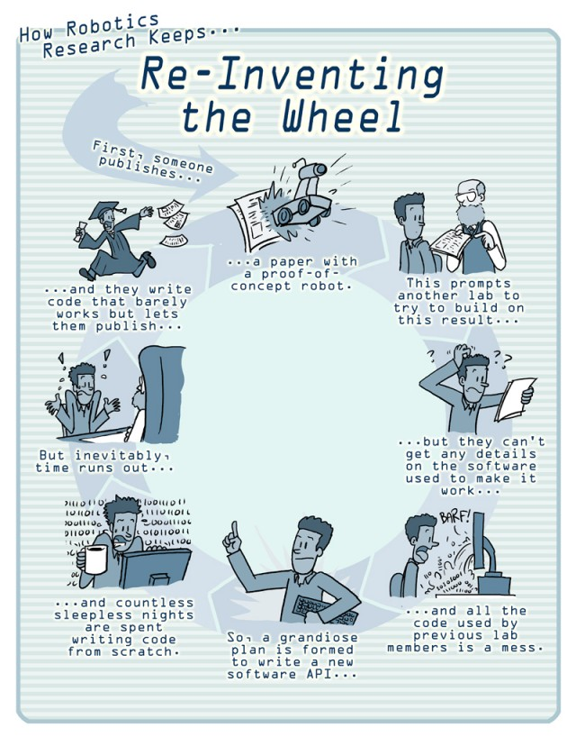
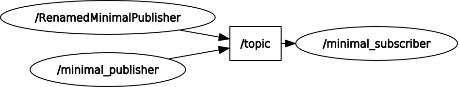

<!--
author:  André Dietrich; Sebastian Zug

mode:   Presentation

comment: Interactive LiaScript workshop at Federal University of Amazonas

-->

[](https://liascript.github.io/course/?https://raw.githubusercontent.com/SebastianZug/Introduction_to_ROS2/main/ROS2_concepts.md)

# ROS Concepts

Let us assume that we would like to participate in next years [RoboCup](https://atwork.robocup.org/).

!?[RoboterSystem](https://www.youtube.com/watch?v=fzz1FNryAbk)

> Which functionalities need to be addressed by a software implementation?

## Do not reinvent the wheel

... for:

+ grasping
+ localization
+ mapping
+ obstacle detection
+ invers kinematics
+ ...



[^Willow]: Willow Garage, http://www.willowgarage.com/blog/2010/04/27/reinventing-wheel, 2010

## But which wheel to use?

> What are the parameters of a robotics framework?

       {{0-1}}
*********************************************

1. Hardware support and runtime environment

  + **Operating system** A robotics development environment should offer multiple operating systems and the widest possible coverage for frequently used libraries, components or hardware drivers.
  + **Support for resource-limited systems** Interaction and co-operation with resource-limited systems is required in areas where, for example, the efficiency and costs of the components used play a key role. Appropriate support for such systems is desirable for a wide range of applications of the respective framework.
  + **Real-time capability** Robotics applications often include application elements that place strict real-time requirements on processing. Control loops for controlling manipulators require deterministic time behaviour in order to run stably.
  + **Driver integration** A framework should not only support a variety of sensors and actuators, but also concrete robot systems from specific manufacturers that are based on these components.

*********************************************

       {{1-2}}
*********************************************

2. Communication

  + **Communication middleware** Appropriate mechanisms are required so that applications can run distributed across several computer nodes and thus ensure location independence.
  + **Communication paradigms** In the context of an application, it is desirable to cover different forms of message exchange between the components. The *client-server relationship* and the *publish-subscribe model* are conceivable interaction patterns.
  + **Real-time capability** Following on from the real-time capability of the runtime environment, the deterministic behaviour of the communication connections is a prerequisite for the development of time-critical systems.

*********************************************

       {{2-3}}
*********************************************

3. Programming

  + **Supported programming languages** When developing applications, the developer should be given the choice of which programming language to use. A domain-specific question is aimed at the possibility of graphical programming.
  + **Support libraries** Predefined components, e.g. for path planning, behaviour selection and localisation, facilitate the development process and promote the reuse of software modules, although appropriate adaptations may be necessary.
  + **Expandability** Expandability here means support for adding new software modules and new hardware components to the existing framework.
  + **Licence model** The type of license for the framework determines its general applicability, particularly in the case of commercial use. The selected license model at least partly determines the breadth of the development community. An active community facilitates development work and offers a variety of answers, suggestions and sample code in wikis or forums.

*********************************************

       {{3-4}}
*********************************************

4. Testing and debugging

  + **Monitoring** It must be possible to monitor the individual components and their relationships to each other in a comprehensive approach in order to make convenient statements about the status of the robot system. A graphical interface that visualises individual components, the overall system or individual parameters simplifies development considerably.
  + **Logging** The logging of the application operation supports debugging on the one hand and enables this application execution to be repeated in the sense of replaying a recording on the other. This makes it possible to analyse the implemented functionalities offline so that statements can also be made about the performance of these or the overall system.
  + **Simulation** The simulation of the real world enables developers to test their applications without having to own the corresponding hardware by modelling it appropriately. The simulators can take the form of "simple" two-dimensional or complex 3D realisations with realistic physical conditions.

*********************************************

## ROS, what is it?

Robot Operating System (ROS) is a framework for the development of robots. In 2020, the statistics listed several thousand repositories and packages. ROS is published under the BSD licence and is therefore part of the open source scene.

The main components and tasks of ROS are:

+ hardware abstraction
+ device drivers
+ frequently reused functionality
+ message exchange between programmes or programme parts
+ package management
+ tools for managing and operating the software on several computers

> ROS is **not*** an operating system but a middleware with a package structure. 

Development began in 2007 at the Stanford Artificial Intelligence Laboratory as part of the Stanford AI Robot Project (STAIR) and was further developed from 2009, mainly at the Willow Garage robotics institute. Since April 2012, ROS has been supported by the newly founded non-profit organisation Open Source Robotics Foundation (OSRF) and has been coordinated, maintained and further developed by Willow Garage since it ceased operations in 2013.

The ROS website can be found at [ROS](https://www.ros.org/).

## ROS 1 vs. ROS 2

Since the beginning of the development of ROS 2.0, a distinction has been made between ROS 1 and ROS 2. The two main versions are not compatible with each other, but are interoperable and can be run in parallel.

The current versions are

+ ROS1 - _Noetic Ninjemys_ (Noetic Ninjemys Oweni) released in May 2020 and
+ ROS2 - _Humble Hawksbill_ (humble hawksbill turtle) release in May 2021 (LTS version).
+ ROS2 - _Iron Irwini_ (iron Irwin's turtle) release in May 2023.

> Take a view to [ROS Metrics](https://metrics.ros.org/packages_rosdistro.html)

| Feature                      | ROS1                                                                                      | ROS2                                                                                                                                                                          |
| :--------------------------- | :---------------------------------------------------------------------------------------- | :---------------------------------------------------------------------------------------------------------------------------------------------------------------------------- |
| Operating systems            | Linux (Ubuntu, Gentoo, Debian), OS X                                                      | Linux (Ubuntu), OS X, Windows 10                                                                                                                                              |
| Programming languages C      | C++03                                                                                     | C++11 (individual concepts of C++14)                                                                                                                                          |
| Programming languages Python | Python 2                                                                                  | Python 3.5                                                                                                                                                                    |
| middleware                   | own concepts for data exchange                                                            | abstract middleware concept open for specific solutions (currently DDS as default implementation), real-time applications can be realised with a suitable middleware approach |
| Build System                 | [CMake](https://cmake.org/) projects with [catkin](https://docs.ros.org/api/catkin/html/) | CMake projects (with colcon), other systems can be integrated                                                                                                                 |
| Package structure            | Integrating packages possible                                                             | only isolated packages for reasons of automated dependency resolution                                                                                                         |

## Basic concepts

**Node** - A node is a participant in the ROS graph. ROS nodes use a ROS client library to communicate with other nodes. Nodes can be in the same process, in different processes or on different computers.

**Topics** - Topics represent the content of a message and thus allow the decoupling of information source and information sink. The nodes do not need to know who they are communicating with, just the "label" or "topic" is sufficient.  *Topics* are intended for unidirectional, streaming communication. *Nodes* that need to make *remote procedure calls*, i.e. receive a response to a request, should use *services* instead.

**Messages** - To enable the communication of data packets between the nodes, their structure and content format must be specified. Which data formats are used, where is the sending sensor located, which units of measurement represent the information? ROS defines abstract message types for this purpose.



> How does it work?

*Nodes* are recognised automatically via the underlying middleware of ROS2. When a node is started, it announces its presence to other nodes in the network with the same ROS domain (defined with the environment variable `ROS_DOMAIN_ID`). Nodes respond to this announcement with information about themselves so that the corresponding connections can be established and the nodes can communicate. Nodes only establish connections to other nodes if they have compatible Quality of Service settings.

## Message types

The ROS2 message specification integrates various configuration options. At the highest level, these are simple name and type assignments. A distinction is made between so-called built-in types and user-specific types. Field names must be lower-case alphanumeric characters with underscores to separate words. The type definitions of the basic types are based on "C++ close" identifiers (`bool`, `char`, `float32` etc. )

Complex types are specified as follows

<!-- data-type="none" -->
| Index | ROS2 msg Type           | C++                |
| :---- | :---------------------- | :----------------- |
| 0     | e.g. `float32`          | `float`            |
| 1     | `string`                | `std::string`      |
| 2     | static array            | `std::array<T, N>` |
| 3     | unbounded dynamic array | `std::vector<T>`   |
| 4     | bounded dynamic array   | custom_class<T,N>  |
| 5     | bounded string          | `std::string`      |

The following are examples of the

```
# Basic format: fieldtype1 fieldname1
# Type 0, 1 examples:
int32 my_int
string my_string

# Type 2
int32[5] five_integers_array
# Type 3
int32[] unbounded_integer_array
# Type 4
int32[<=5] up_to_five_integers_array

# Type 5
string<=10 up_to_ten_characters_string
string[<=5] up_to_five_unbounded_strings
string<=10[] unbounded_array_of_string_up_to_ten_characters each
string<=10[<=5] up_to_five_strings_up_to_ten_characters_each
```

Another new feature is the ability to define default values and constants.

```
# Field default values
uint8 x 42
int16 y -2000
string full_name "John Doe"
int32[] samples [-200, -100, 0, 100, 200]

# Constant values with "="
int32 X=123
string FOO="foo"
```

## Command line tools

The exploration and examination of a ROS2 system is carried out using the "ros2" tool. 

```
ros2
usage: ros2 [-h] [--use-python-default-buffering]
            Call `ros2 <command> -h` for more detailed usage. ...

ros2 is an extensible command-line tool for ROS 2.

options:
  -h, --help            show this help message and exit
  --use-python-default-buffering
                        Do not force line buffering in stdout and instead use
                        the python default buffering, which might be affected
                        by PYTHONUNBUFFERED/-u and depends on whatever stdout
                        is interactive or not

Commands:
  action     Various action related sub-commands
  bag        Various rosbag related sub-commands
  component  Various component related sub-commands
  daemon     Various daemon related sub-commands
  doctor     Check ROS setup and other potential issues
  interface  Show information about ROS interfaces
  launch     Run a launch file
  lifecycle  Various lifecycle related sub-commands
  multicast  Various multicast related sub-commands
  node       Various node related sub-commands
  param      Various param related sub-commands
  pkg        Various package related sub-commands
  run        Run a package specific executable
  security   Various security related sub-commands
  service    Various service related sub-commands
  topic      Various topic related sub-commands
  wtf        Use `wtf` as alias to `doctor`

  Call `ros2 <command> -h` for more detailed usage.
```

### Start a node 

Open a new terminal and run:

```
> ros2 run turtlesim turtlesim_node
```

Open another terminal and run:

```
> ros2 run turtlesim turtle_teleop_key
```

> Control the small turtle by your keyboard inputs.


### Inspect the ROS system 

Which topics are available in our applications?

```
> ros2 topic list
> ros2 topic list -t
> ros2 topic hz /turtle1/pose
```

Probably the ros2 topic command is not suitable to inspect the system. Let us try the rqt_graph tool.

```
> rqt_graph
``

> What happens if you additionally call `ros2 topic echo /turtle1/cmd_vel` with the graph?

```
> ros2 topic info /turtle1/cmd_vel
``

> Explain the output of the command.

### Read messages from cli

> Read the speed information in the commandline. Investigate the documentation or ask Use ChatGPT for this purpose.

### Transmit messages from cli

> Send a speed command from commandline to the turtle.

1. What is the message type of `/turtle1/cmd_vel`

```
> ros2 topic info /turtle1/cmd_vel
> ros2 interface show geometry_msgs/msg/Twist
```

Obviously, we have 2 3x1 vectors for linear and angular velocity.

2. How to send a message from commandline?

```
ros2 topic pub <topic_name> <msg_type> '<args>'
```

```
ros2 topic pub --once /turtle1/cmd_vel geometry_msgs/msg/Twist "{linear: {x: 2.0, y: 0.0, z: 0.0}, angular: {x: 0.0, y: 0.0, z: 1.8}}"
```

> How can we "rerun" the command? Investigate the documentation for this question. Use ChatGPT for this purpose.

## Exercises

> __Exercise 1__: Inspect a message format with the following command:

```
> ros2 interface show sensor_msgs/msg/LaserScan
```

> Which fields are contained in this message type?

> __Exercise 2__: Use ros bag to record the messages of the turtle simulation. 

```
> ros2 bag record /turtle1/cmd_vel
```

The data will be accumulated in a new bag directory with a name in the pattern of `rosbag2_year_month_day-hour_minute_second`. This directory will contain a `metadata.yaml` along with the bag file in the recorded format.

```
cat metadata.yaml 
rosbag2_bagfile_information:
  version: 5
  storage_identifier: sqlite3
  duration:
    nanoseconds: 15619166916
  starting_time:
    nanoseconds_since_epoch: 1702109372283709030
  message_count: 144
  topics_with_message_count:
    - topic_metadata:
        name: /turtle1/cmd_vel
        type: geometry_msgs/msg/Twist
        serialization_format: cdr
        offered_qos_profiles: "- history: 3\n  depth: 0\n  reliability: 1\n  durability: 2\n  deadline:\n    sec: 9223372036\n    nsec: 854775807\n  lifespan:\n    sec: 9223372036\n    nsec: 854775807\n  liveliness: 1\n  liveliness_lease_duration:\n    sec: 9223372036\n    nsec: 854775807\n  avoid_ros_namespace_conventions: false"
      message_count: 144
  compression_format: ""
  compression_mode: ""
  relative_file_paths:
    - rosbag2_2023_12_09-09_09_20_0.db3
  files:
    - path: rosbag2_2023_12_09-09_09_20_0.db3
      starting_time:
        nanoseconds_since_epoch: 1702109372283709030
      duration:
        nanoseconds: 15619166916
      message_count: 144%
```

Replay the bag file with the following command:

```
ros2 bag play rosbag2_2023_12_09-09_09_20/
```