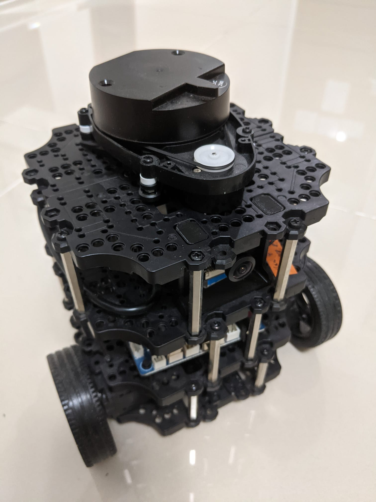

<!--
author:  André Dietrich; Sebastian Zug

mode:   Presentation

comment: Interactive LiaScript workshop at Federal University of Amazonas

-->

# Turtlebot Demonstration

> Take a view on the [documentation](https://emanual.robotis.com/docs/en/platform/turtlebot3/overview/).

